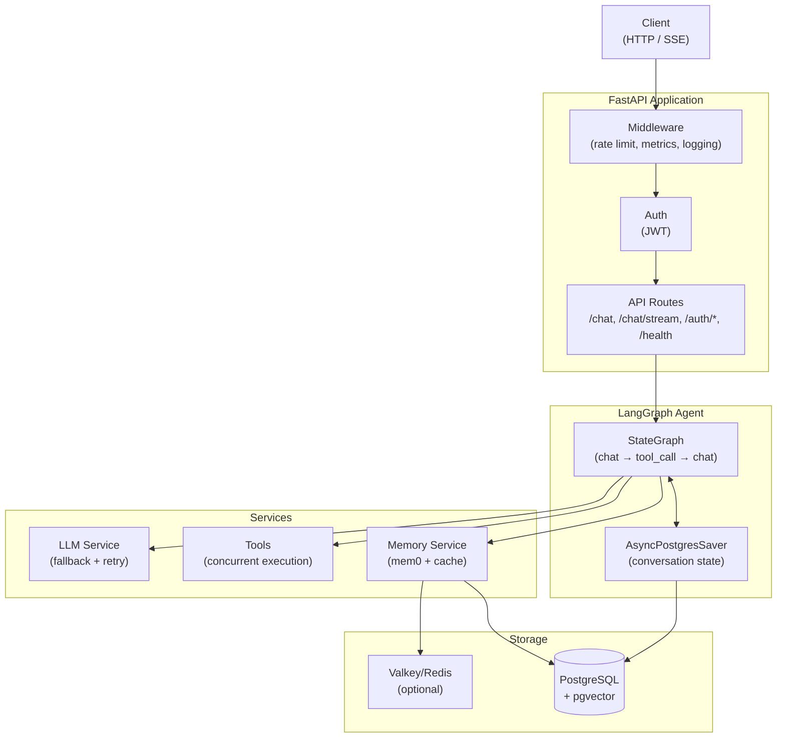
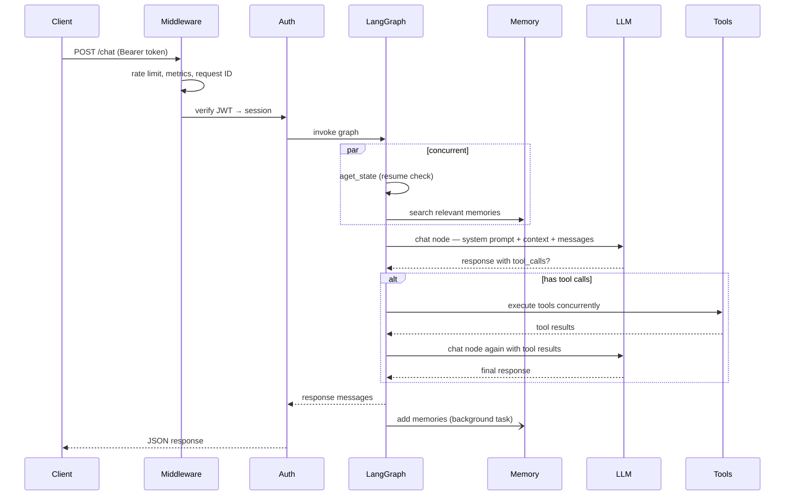
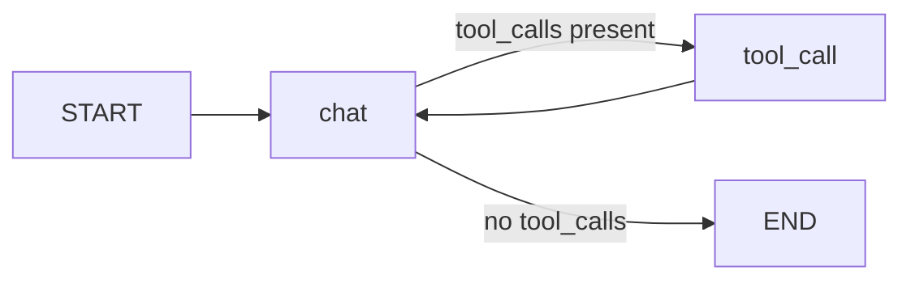

# Architecture 架构设计
## System Overview 系统整体结构
项目采用**5层企业级AI智能体架构**，基于 FastAPI + LangGraph + PostgreSQL 构建，聚焦自然语言交互、工具调用、企业数据分析与自动可视化能力。
- **客户端**：浏览器/APP发起 HTTP 或 SSE 流式请求
- **FastAPI 主程序**：请求入口、中间件、认证、接口路由
- **LangGraph 智能体核心**：对话流程编排、状态持久化、工具调度
- **内部服务**：大模型调度、语义记忆、工具并发执行
- **存储仓库**：PostgreSQL（主数据+向量）、Valkey/Redis 缓存

## Request Lifecycle 请求生命周期
1. 客户端携带 JWT 发起 `/chat` 请求
2. 中间件执行限流、日志、请求ID生成
3. JWT 认证解析用户与会话信息
4. 启动 LangGraph 流程，**并发执行**：会话状态检查 + 历史记忆检索
5. 聊天节点组装上下文，调用大模型
6. 需工具调用则**并发执行**，结果回传模型生成最终回答
7. 同步返回响应，异步后台保存记忆

## Agent Graph 智能体核心逻辑
基于双节点 `StateGraph` 实现循环工作流，支持会话状态持久化与断点续聊。

- **chat 节点**：构建提示词、调用 LLM、路由至工具节点或结束流程
- **tool_call 节点**：并发执行工具，结果回传聊天节点
- **Checkpointer**：`AsyncPostgresSaver` 按会话 ID 持久化状态

## Key Design Decisions 核心设计思路
1. **并发优化**：记忆检索与状态检查并行，节省 200–500ms 响应耗时
2. **工具并发**：多工具同时执行，无串行等待
3. **提示词缓存**：启动时加载系统提示词，请求仅做变量填充
4. **LLM 超时管控**：调用全链路加超时，避免服务阻塞
5. **会话数据复用**：用户信息存入会话，减少重复数据库查询
6. **异步标题生成**：后台生成会话标题，无响应延迟，原子更新防重复

## Component Responsibilities 组件职责
| 组件 | 文件路径 | 核心职责 |
|------|----------|----------|
| LangGraph Agent | `app/core/langgraph/shturl.c` | 对话流程编排、状态管理、工具调度 |
| LLM Service | `app/services/llm/` | 多模型注册、重试、自动兜底、结构化输出 |
| Memory Service | `app/services/shturl.cc` | 语义记忆、向量检索、缓存加速 |
| Session Naming | `app/services/session_shturl.cc` | 后台异步生成会话标题 |
| Database Service | `app/services/shturl.cc/Q` | 用户/会话数据增删改查 |
| Cache Service | `app/core/shturl.c` | Redis/Valkey 缓存，无缓存本地降级 |
| Middleware | `app/core/shturl.cc/oZg` | 限流、日志、性能埋点、请求ID |
| Auth | `app/api/v1/shturl.` | JWT 签发/校验、会话管理 |
| Tools | `app/core/langgraph/tools/` | 联网搜索、人工确认、数据查询、数据分析、自动绘图、可视化报表 |