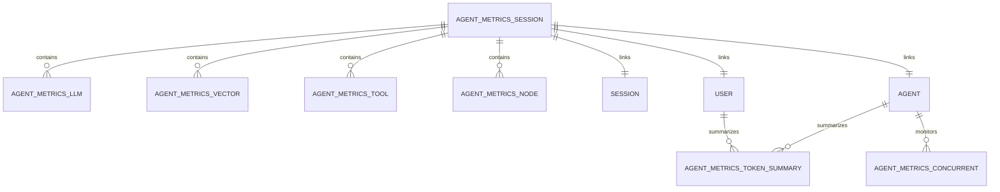
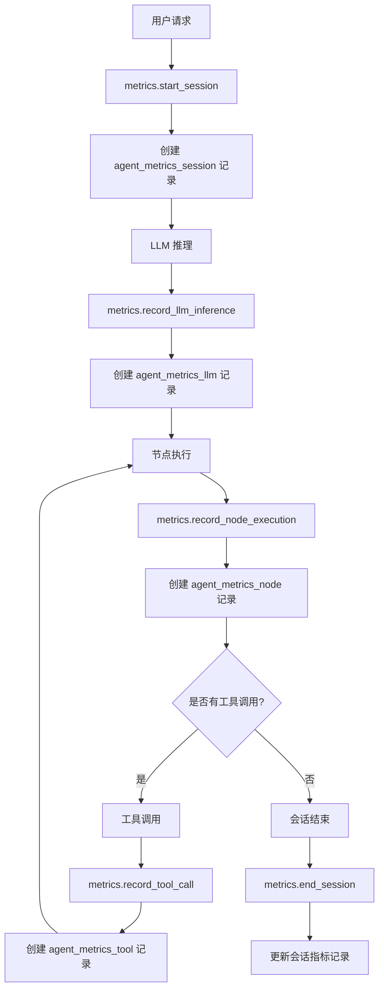
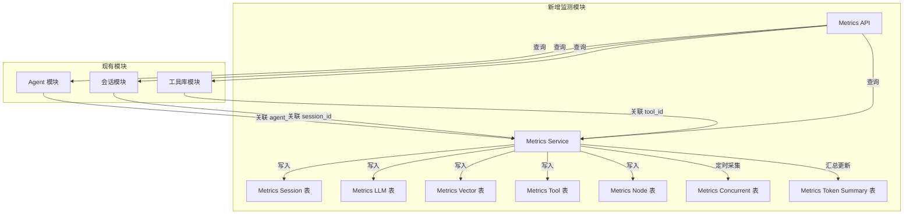
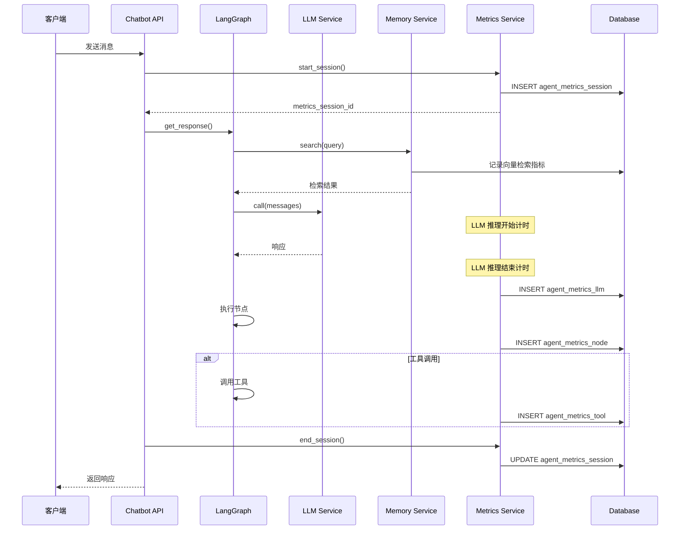
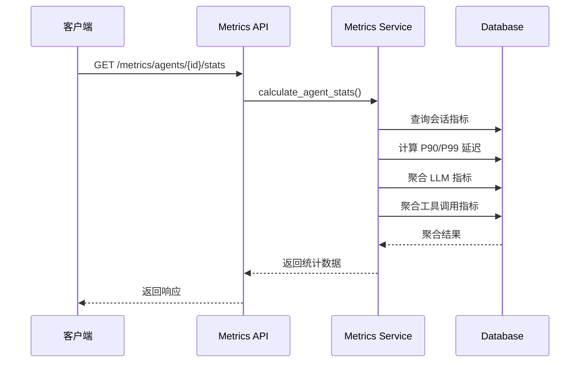

# Agent 全链路运行监测指标采集模块 - 开发设计文档

## 一、需求概述

### 1.1 模块定位
为企业内部 Agent 测试管理平台新增 **全链路运行监测指标采集模块**，实现对每次 Agent 会话执行全程的自动性能数据采集、存储、聚合统计和查询展示。

### 1.2 核心价值
- **性能监控**：实时掌握 Agent 响应延迟、吞吐量
- **成本分析**：Token 消耗统计，支持算力成本核算
- **问题定位**：全链路耗时拆解，快速定位性能瓶颈
- **容量规划**：并发负载数据支撑容量评估

---

## 二、指标采集清单

### 2.1 必采指标矩阵

| 指标类别 | 指标名称 | 单位 | 说明 |
|----------|----------|------|------|
| **Agent 整体** | 端到端总耗时 | ms | 从请求到响应完成 |
| | P90 延迟 | ms | 90% 请求耗时阈值 |
| | P99 延迟 | ms | 99% 请求耗时阈值 |
| **LLM 推理** | LLM 推理耗时 | ms | 模型推理总耗时 |
| | TTFT 首 Token 耗时 | ms | Time To First Token |
| | 输入 Token 数 | count | 本次请求输入量 |
| | 输出 Token 数 | count | 本次响应输出量 |
| | 总 Token 数 | count | 输入 + 输出 |
| **向量检索** | PGVector 单次检索耗时 | ms | 记忆检索耗时 |
| | 检索结果数 | count | 召回文档数 |
| **工具调用** | Tool API 单次耗时 | ms | 每个工具独立计时 |
| | 工具名称 | - | 被调用的工具标识 |
| | 调用结果 | - | 成功/失败/超时 |
| **LangGraph 节点** | 单节点执行耗时 | ms | 每个节点独立计时 |
| | 节点类型 | - | chat/tool_call/end |
| | 状态流转步数 | count | 本次会话总节点数 |
| **并发监控** | 实时并发会话数 | count | 当前活跃会话 |
| | 单 Agent 并发任务数 | count | 同 Agent 同时执行数 |

### 2.2 Token 消耗统计字段

| 字段名 | 类型 | 说明 |
|--------|------|------|
| input_tokens | INTEGER | 输入 Token 数量 |
| output_tokens | INTEGER | 输出 Token 数量 |
| total_tokens | INTEGER | 总 Token 数量 |
| token_cost | DECIMAL | 估算成本（基于单价） |

---

## 三、数据库表结构设计

### 3.1 新增数据表

#### 3.1.1 `agent_metrics_session` - 会话级性能指标表

| 字段名 | 类型 | 约束 | 注释 |
|--------|------|------|------|
| id | UUID | PK | 主键 |
| session_id | VARCHAR(100) | FK, INDEX | 关联会话 ID |
| agent_id | UUID | FK, INDEX | 关联 Agent ID |
| user_id | INTEGER | FK, INDEX | 操作用户 ID |
| started_at | TIMESTAMP | NOT NULL | 会话开始时间 |
| ended_at | TIMESTAMP | NULL | 会话结束时间 |
| total_duration_ms | BIGINT | NOT NULL | 端到端总耗时(毫秒) |
| status | VARCHAR(20) | NOT NULL | running/success/failed/timeout |
| error_message | TEXT | NULL | 错误信息 |
| created_at | TIMESTAMP | DEFAULT NOW() | 创建时间 |

**外键约束**：
- `session_id` → `session.id`
- `agent_id` → `agent.id`
- `user_id` → `user.id`

**索引**：
- `idx_metrics_session_id` ON `session_id`
- `idx_metrics_agent_id` ON `agent_id`
- `idx_metrics_user_id` ON `user_id`
- `idx_metrics_started_at` ON `started_at`

---

#### 3.1.2 `agent_metrics_llm` - LLM 推理指标表

| 字段名 | 类型 | 约束 | 注释 |
|--------|------|------|------|
| id | UUID | PK | 主键 |
| metrics_session_id | UUID | FK, INDEX | 关联会话指标 ID |
| session_id | VARCHAR(100) | FK, INDEX | 关联会话 ID |
| llm_model | VARCHAR(50) | NOT NULL | 调用的模型名称 |
| inference_duration_ms | BIGINT | NOT NULL | LLM 推理耗时 |
| ttft_ms | BIGINT | NULL | 首 Token 输出耗时 |
| input_tokens | INTEGER | NOT NULL | 输入 Token 数 |
| output_tokens | INTEGER | NOT NULL | 输出 Token 数 |
| total_tokens | INTEGER | NOT NULL | 总 Token 数 |
| token_cost | DECIMAL(10,6) | NULL | Token 成本估算 |
| status | VARCHAR(20) | NOT NULL | success/failed |
| error_message | TEXT | NULL | 错误信息 |
| created_at | TIMESTAMP | DEFAULT NOW() | 创建时间 |

**外键约束**：
- `metrics_session_id` → `agent_metrics_session.id`
- `session_id` → `session.id`

**索引**：
- `idx_llm_metrics_session_id` ON `metrics_session_id`
- `idx_llm_session_id` ON `session_id`
- `idx_llm_created_at` ON `created_at`

---

#### 3.1.3 `agent_metrics_vector` - 向量检索指标表

| 字段名 | 类型 | 约束 | 注释 |
|--------|------|------|------|
| id | UUID | PK | 主键 |
| metrics_session_id | UUID | FK, INDEX | 关联会话指标 ID |
| session_id | VARCHAR(100) | FK, INDEX | 关联会话 ID |
| search_duration_ms | BIGINT | NOT NULL | 检索耗时(毫秒) |
| results_count | INTEGER | NOT NULL | 召回结果数 |
| query_length | INTEGER | NULL | 查询长度 |
| memory_type | VARCHAR(20) | NULL | short_term/long_term |
| status | VARCHAR(20) | NOT NULL | success/failed |
| created_at | TIMESTAMP | DEFAULT NOW() | 创建时间 |

**索引**：
- `idx_vector_metrics_session_id` ON `metrics_session_id`
- `idx_vector_session_id` ON `session_id`

---

#### 3.1.4 `agent_metrics_tool` - 工具调用指标表

| 字段名 | 类型 | 约束 | 注释 |
|--------|------|------|------|
| id | UUID | PK | 主键 |
| metrics_session_id | UUID | FK, INDEX | 关联会话指标 ID |
| session_id | VARCHAR(100) | FK, INDEX | 关联会话 ID |
| tool_name | VARCHAR(100) | NOT NULL | 工具名称 |
| tool_id | UUID | FK, INDEX | 关联工具 ID |
| call_duration_ms | BIGINT | NOT NULL | 调用耗时(毫秒) |
| input_params | JSONB | NULL | 输入参数 |
| output_result | TEXT | NULL | 输出结果摘要 |
| status | VARCHAR(20) | NOT NULL | success/failed/timeout |
| error_message | TEXT | NULL | 错误信息 |
| created_at | TIMESTAMP | DEFAULT NOW() | 创建时间 |

**索引**：
- `idx_tool_metrics_session_id` ON `metrics_session_id`
- `idx_tool_session_id` ON `session_id`
- `idx_tool_name` ON `tool_name`

---

#### 3.1.5 `agent_metrics_node` - LangGraph 节点执行指标表

| 字段名 | 类型 | 约束 | 注释 |
|--------|------|------|------|
| id | UUID | PK | 主键 |
| metrics_session_id | UUID | FK, INDEX | 关联会话指标 ID |
| session_id | VARCHAR(100) | FK, INDEX | 关联会话 ID |
| node_name | VARCHAR(50) | NOT NULL | 节点名称 |
| node_type | VARCHAR(20) | NOT NULL | 节点类型：chat/tool_call/end |
| execution_order | INTEGER | NOT NULL | 执行顺序 |
| duration_ms | BIGINT | NOT NULL | 执行耗时(毫秒) |
| input_snapshot | JSONB | NULL | 输入状态快照 |
| output_snapshot | JSONB | NULL | 输出状态快照 |
| status | VARCHAR(20) | NOT NULL | success/failed |
| created_at | TIMESTAMP | DEFAULT NOW() | 创建时间 |

**索引**：
- `idx_node_metrics_session_id` ON `metrics_session_id`
- `idx_node_session_id` ON `session_id`
- `idx_node_execution_order` ON `execution_order`

---

#### 3.1.6 `agent_metrics_concurrent` - 并发监控快照表

| 字段名 | 类型 | 约束 | 注释 |
|--------|------|------|------|
| id | UUID | PK | 主键 |
| agent_id | UUID | FK, INDEX | Agent ID |
| active_sessions | INTEGER | NOT NULL | 当前活跃会话数 |
| active_tasks | INTEGER | NOT NULL | 当前活跃任务数 |
| recorded_at | TIMESTAMP | NOT NULL, INDEX | 记录时间 |

**索引**：
- `idx_concurrent_agent_id` ON `agent_id`
- `idx_concurrent_recorded_at` ON `recorded_at`

---

#### 3.1.7 `agent_metrics_token_summary` - Token 消耗汇总表

| 字段名 | 类型 | 约束 | 注释 |
|--------|------|------|------|
| id | UUID | PK | 主键 |
| agent_id | UUID | FK, INDEX | Agent ID |
| user_id | INTEGER | FK, INDEX | 用户 ID |
| date | DATE | NOT NULL, INDEX | 统计日期 |
| total_input_tokens | BIGINT | DEFAULT 0 | 输入 Token 总量 |
| total_output_tokens | BIGINT | DEFAULT 0 | 输出 Token 总量 |
| total_tokens | BIGINT | DEFAULT 0 | Token 总量 |
| total_cost | DECIMAL(12,4) | DEFAULT 0 | 总成本 |
| request_count | INTEGER | DEFAULT 0 | 请求次数 |
| created_at | TIMESTAMP | DEFAULT NOW() | 创建时间 |
| updated_at | TIMESTAMP | DEFAULT NOW() | 更新时间 |

**唯一约束**：
- `uk_token_summary_agent_date` ON `(agent_id, user_id, date)`

---

### 3.2 数据表 ER 关系图



---

## 四、全链路埋点插入逻辑

### 4.1 埋点架构设计

```
┌─────────────────────────────────────────────────────────────────┐
│                    LangGraph Agent 执行流程                      │
├─────────────────────────────────────────────────────────────────┤
│                                                                  │
│  1. get_response() 入口                                          │
│     └── metrics_service.start_session()  → 创建会话指标记录       │
│                                                                  │
│  2. 状态检查与记忆检索                                            │
│     └── metrics_service.record_vector_search()  → 记录向量检索    │
│                                                                  │
│  3. LLM 推理 (_chat 节点)                                        │
│     └── metrics_service.record_llm_inference()  → 记录 LLM 指标  │
│                                                                  │
│  4. 节点执行 (_chat / _tool_call 节点)                          │
│     └── metrics_service.record_node_execution()  → 记录节点耗时   │
│                                                                  │
│  5. 工具调用 (_tool_call 节点)                                    │
│     └── metrics_service.record_tool_call()  → 记录工具调用指标    │
│                                                                  │
│  6. get_response() 结束                                         │
│     └── metrics_service.end_session()  → 更新会话指标、计算总耗时 │
│                                                                  │
└─────────────────────────────────────────────────────────────────┘
```

### 4.2 埋点代码位置标注

#### 4.2.1 文件：`app/core/langgraph/graph.py`

**位置 1：get_response() 方法入口（约第 280 行）**

```python
# === 埋点开始：会话级指标初始化 ===
metrics_session_id = await metrics_service.start_session(
    session_id=session_id,
    agent_id=agent_id,  # 从 session 中获取
    user_id=user_id
)
# ===================================
```

**位置 2：_chat 节点（约第 160 行）- LLM 推理埋点**

```python
# === 埋点开始：LLM 推理指标 ===
llm_start_time = time.time()
llm_start_tokens = get_current_token_count()  # 获取输入 token 数

response_message = await self.llm_service.call(dump_messages(messages))

llm_end_time = time.time()
llm_end_tokens = get_output_token_count()  # 获取输出 token 数

await metrics_service.record_llm_inference(
    metrics_session_id=metrics_session_id,
    session_id=session_id,
    llm_model=model_name,
    inference_duration_ms=int((llm_end_time - llm_start_time) * 1000),
    input_tokens=llm_start_tokens,
    output_tokens=llm_end_tokens,
    total_tokens=llm_start_tokens + llm_end_tokens
)
# === 埋点结束 ===
```

**位置 3：_chat 节点 - 节点执行埋点**

```python
# === 埋点开始：节点执行指标 ===
await metrics_service.record_node_execution(
    metrics_session_id=metrics_session_id,
    session_id=session_id,
    node_name="chat",
    node_type="chat",
    duration_ms=int((time.time() - node_start_time) * 1000),
    status="success"
)
# === 埋点结束 ===
```

**位置 4：_tool_call 节点（约第 200 行）- 工具调用埋点**

```python
# === 埋点开始：工具调用指标 ===
tool_start_time = time.time()

tool_result = await self.tools_by_name[tool_call["name"]].ainvoke(tool_call["args"])

tool_end_time = time.time()

await metrics_service.record_tool_call(
    metrics_session_id=metrics_session_id,
    session_id=session_id,
    tool_name=tool_call["name"],
    tool_id=get_tool_id_by_name(tool_call["name"]),
    call_duration_ms=int((tool_end_time - tool_start_time) * 1000),
    input_params=tool_call["args"],
    status="success"
)
# === 埋点结束 ===
```

**位置 5：_tool_call 节点 - 工具节点执行埋点**

```python
# === 埋点开始：工具节点执行指标 ===
await metrics_service.record_node_execution(
    metrics_session_id=metrics_session_id,
    session_id=session_id,
    node_name="tool_call",
    node_type="tool_call",
    duration_ms=int((time.time() - node_start_time) * 1000),
    status="success"
)
# === 埋点结束 ===
```

**位置 6：get_response() 结束（约第 330 行）**

```python
# === 埋点结束：会话级指标汇总 ===
total_duration = int((time.time() - session_start_time) * 1000)
node_count = await metrics_service.get_session_node_count(metrics_session_id)

await metrics_service.end_session(
    metrics_session_id=metrics_session_id,
    total_duration_ms=total_duration,
    status="success",
    node_count=node_count
)
# ===================================
```

---

#### 4.2.2 文件：`app/services/memory.py`

**位置：search() 方法 - 向量检索埋点**

```python
# === 埋点开始：向量检索指标 ===
vector_start_time = time.time()

results = await self.vector_store.asimilarity_search(
    query=query,
    k=k
)

vector_end_time = time.time()

await metrics_service.record_vector_search(
    metrics_session_id=metrics_session_id,  # 从上下文获取
    session_id=session_id,
    search_duration_ms=int((vector_end_time - vector_start_time) * 1000),
    results_count=len(results),
    status="success"
)
# === 埋点结束 ===
```

---

### 4.3 埋点数据流向图



---

## 五、RESTful 接口清单

### 5.1 指标查询接口

#### 5.1.1 获取会话完整性能明细

**GET** `/api/v1/metrics/sessions/{session_id}`

| 参数 | 类型 | 位置 | 必填 | 说明 |
|------|------|------|------|------|
| session_id | STRING | Path | 是 | 会话 ID |

**权限**：
- 普通用户：仅可查询自己私有 Agent、公共 Agent 的会话
- 管理员：可查询所有会话

**响应**：
```json
{
  "code": 200,
  "message": "success",
  "data": {
    "session_info": {
      "session_id": "abc123",
      "agent_id": "uuid",
      "agent_name": "订单助手",
      "user_id": 1,
      "user_name": "张三",
      "started_at": "2024-01-01T10:00:00",
      "ended_at": "2024-01-01T10:00:05",
      "total_duration_ms": 5000,
      "status": "success"
    },
    "llm_metrics": {
      "llm_model": "qwen-turbo",
      "inference_duration_ms": 3500,
      "ttft_ms": 150,
      "input_tokens": 500,
      "output_tokens": 200,
      "total_tokens": 700,
      "token_cost": 0.0021
    },
    "vector_metrics": [{
      "search_duration_ms": 50,
      "results_count": 3,
      "memory_type": "long_term"
    }],
    "tool_metrics": [{
      "tool_name": "generate_chart",
      "call_duration_ms": 800,
      "status": "success"
    }],
    "node_metrics": [{
      "node_name": "chat",
      "node_type": "chat",
      "execution_order": 1,
      "duration_ms": 3800,
      "status": "success"
    }]
  }
}
```

---

#### 5.1.2 按 Agent 聚合统计

**GET** `/api/v1/metrics/agents/{agent_id}/stats`

| 参数 | 类型 | 位置 | 必填 | 说明 |
|------|------|------|------|------|
| agent_id | UUID | Path | 是 | Agent ID |
| start_date | DATE | Query | 否 | 开始日期 |
| end_date | DATE | Query | 否 | 结束日期 |

**权限**：
- 普通用户：仅可查询自己私有 Agent、公共 Agent
- 管理员：可查询所有 Agent

**响应**：
```json
{
  "code": 200,
  "message": "success",
  "data": {
    "agent_id": "uuid",
    "agent_name": "订单助手",
    "period": {
      "start_date": "2024-01-01",
      "end_date": "2024-01-31"
    },
    "session_stats": {
      "total_sessions": 1500,
      "success_count": 1450,
      "failed_count": 50,
      "success_rate": 0.967
    },
    "latency_stats": {
      "avg_duration_ms": 3500,
      "p50_latency_ms": 3200,
      "p90_latency_ms": 4500,
      "p95_latency_ms": 5200,
      "p99_latency_ms": 6500,
      "min_duration_ms": 1500,
      "max_duration_ms": 12000
    },
    "token_stats": {
      "total_input_tokens": 750000,
      "total_output_tokens": 300000,
      "total_tokens": 1050000,
      "avg_input_tokens": 500,
      "avg_output_tokens": 200,
      "total_cost": 315.00
    },
    "llm_stats": {
      "avg_inference_duration_ms": 2500,
      "avg_ttft_ms": 120
    },
    "vector_stats": {
      "total_searches": 1500,
      "avg_search_duration_ms": 45
    },
    "tool_stats": {
      "total_calls": 800,
      "avg_call_duration_ms": 350,
      "top_tools": [
        {"tool_name": "generate_chart", "call_count": 500},
        {"tool_name": "duckduckgo_search", "call_count": 300}
      ]
    }
  }
}
```

---

#### 5.1.3 性能指标分页查询

**GET** `/api/v1/metrics/sessions`

| 参数 | 类型 | 位置 | 必填 | 说明 |
|------|------|------|------|------|
| agent_id | UUID | Query | 否 | Agent ID 筛选 |
| user_id | INTEGER | Query | 否 | 用户 ID 筛选 |
| status | STRING | Query | 否 | 状态筛选 |
| start_date | DATE | Query | 否 | 开始日期 |
| end_date | DATE | Query | 否 | 结束日期 |
| sort_by | STRING | Query | 否 | 排序字段 |
| order | STRING | Query | 否 | 排序方向 |
| page | INT | Query | 否 | 页码 |
| size | INT | Query | 否 | 每页数量 |

**权限**：
- 普通用户：仅可查询自己私有 Agent、公共 Agent 的会话
- 管理员：可查询所有会话

**响应**：
```json
{
  "code": 200,
  "message": "success",
  "data": {
    "items": [{
      "session_id": "abc123",
      "agent_id": "uuid",
      "agent_name": "订单助手",
      "user_name": "张三",
      "total_duration_ms": 5000,
      "status": "success",
      "input_tokens": 500,
      "output_tokens": 200,
      "started_at": "2024-01-01T10:00:00"
    }],
    "total": 1000,
    "page": 1,
    "size": 20
  }
}
```

---

#### 5.1.4 公共 Agent 市场统计

**GET** `/api/v1/metrics/market/stats`

| 参数 | 类型 | 位置 | 必填 | 说明 |
|------|------|------|------|------|
| start_date | DATE | Query | 否 | 开始日期 |
| end_date | DATE | Query | 否 | 结束日期 |

**权限**：全员可访问

**响应**：
```json
{
  "code": 200,
  "message": "success",
  "data": {
    "period": {
      "start_date": "2024-01-01",
      "end_date": "2024-01-31"
    },
    "overview": {
      "total_public_agents": 50,
      "total_sessions": 10000,
      "total_tokens": 5000000,
      "total_cost": 1500.00,
      "avg_latency_ms": 3500
    },
    "agent_rankings": [{
      "agent_name": "订单助手",
      "session_count": 2000,
      "total_tokens": 1000000,
      "total_cost": 300.00,
      "avg_latency_ms": 3200
    }],
    "concurrent_stats": {
      "peak_concurrent_sessions": 50,
      "peak_time": "2024-01-15T14:00:00"
    }
  }
}
```

---

#### 5.1.5 并发监控数据

**GET** `/api/v1/metrics/concurrent`

| 参数 | 类型 | 位置 | 必填 | 说明 |
|------|------|------|------|------|
| agent_id | UUID | Query | 否 | Agent ID 筛选 |
| start_time | DATETIME | Query | 否 | 开始时间 |
| end_time | DATETIME | Query | 否 | 结束时间 |

**权限**：
- 普通用户：仅可查询自己私有 Agent、公共 Agent
- 管理员：可查询所有 Agent

**响应**：
```json
{
  "code": 200,
  "message": "success",
  "data": {
    "current": {
      "active_sessions": 15,
      "active_tasks": 20
    },
    "history": [{
      "agent_id": "uuid",
      "agent_name": "订单助手",
      "active_sessions": 10,
      "active_tasks": 12,
      "recorded_at": "2024-01-01T14:00:00"
    }]
  }
}
```

---

### 5.2 Token 消耗统计接口

#### 5.2.1 Token 日消耗明细

**GET** `/api/v1/metrics/token/daily`

| 参数 | 类型 | 位置 | 必填 | 说明 |
|------|------|------|------|------|
| agent_id | UUID | Query | 否 | Agent ID |
| user_id | INTEGER | Query | 否 | 用户 ID |
| start_date | DATE | Query | 否 | 开始日期 |
| end_date | DATE | Query | 否 | 结束日期 |

**权限**：
- 普通用户：仅可查询自己的消耗
- 管理员：可查询所有消耗

**响应**：
```json
{
  "code": 200,
  "message": "success",
  "data": {
    "items": [{
      "agent_id": "uuid",
      "agent_name": "订单助手",
      "date": "2024-01-01",
      "input_tokens": 25000,
      "output_tokens": 10000,
      "total_tokens": 35000,
      "cost": 10.50,
      "request_count": 50
    }],
    "total": {
      "input_tokens": 25000,
      "output_tokens": 10000,
      "total_tokens": 35000,
      "total_cost": 10.50
    }
  }
}
```

---

#### 5.2.2 Token 成本分摊

**GET** `/api/v1/metrics/token/allocation`

| 参数 | 类型 | 位置 | 必填 | 说明 |
|------|------|------|------|------|
| start_date | DATE | Query | 否 | 开始日期 |
| end_date | DATE | Query | 否 | 结束日期 |
| group_by | STRING | Query | 否 | 分组维度：agent/user |

**权限**：仅管理员

**响应**：
```json
{
  "code": 200,
  "message": "success",
  "data": {
    "total_cost": 1500.00,
    "allocations": [{
      "dimension": "agent",
      "dimension_id": "uuid",
      "dimension_name": "订单助手",
      "total_cost": 300.00,
      "cost_ratio": 0.2,
      "total_tokens": 1050000
    }]
  }
}
```

---

### 5.3 管理员专属接口

#### 5.3.1 全量 Agent 性能排名

**GET** `/api/v1/admin/metrics/agents/ranking`

| 参数 | 类型 | 位置 | 必填 | 说明 |
|------|------|------|------|------|
| sort_by | STRING | Query | 否 | 排序：sessions/tokens/cost/latency |
| order | STRING | Query | 否 | 排序方向 |
| limit | INT | Query | 否 | 返回数量 |

**权限**：仅管理员

**响应**：
```json
{
  "code": 200,
  "message": "success",
  "data": {
    "rankings": [{
      "rank": 1,
      "agent_id": "uuid",
      "agent_name": "订单助手",
      "total_sessions": 2000,
      "total_tokens": 1000000,
      "total_cost": 300.00,
      "avg_latency_ms": 3200,
      "success_rate": 0.98
    }]
  }
}
```

---

#### 5.3.2 全量用户 Token 消耗排名

**GET** `/api/v1/admin/metrics/users/ranking`

| 参数 | 类型 | 位置 | 必填 | 说明 |
|------|------|------|------|------|
| sort_by | STRING | Query | 否 | 排序：tokens/cost/sessions |
| order | STRING | Query | 否 | 排序方向 |
| limit | INT | Query | 否 | 返回数量 |

**权限**：仅管理员

---

## 六、P90/P99 延迟聚合计算逻辑

### 6.1 SQL 聚合查询实现

```sql
-- 计算 Agent 的 P90/P99 延迟
SELECT 
    agent_id,
    COUNT(*) as total_sessions,
    AVG(total_duration_ms) as avg_duration,
    PERCENTILE_CONT(0.50) WITHIN GROUP (ORDER BY total_duration_ms) as p50_latency,
    PERCENTILE_CONT(0.90) WITHIN GROUP (ORDER BY total_duration_ms) as p90_latency,
    PERCENTILE_CONT(0.95) WITHIN GROUP (ORDER BY total_duration_ms) as p95_latency,
    PERCENTILE_CONT(0.99) WITHIN GROUP (ORDER BY total_duration_ms) as p99_latency,
    MIN(total_duration_ms) as min_duration,
    MAX(total_duration_ms) as max_duration
FROM agent_metrics_session
WHERE agent_id = :agent_id
  AND started_at >= :start_date
  AND started_at <= :end_date
  AND status = 'success'
GROUP BY agent_id;
```

### 6.2 Python 聚合计算实现

```python
async def calculate_latency_percentiles(
    agent_id: UUID,
    start_date: datetime,
    end_date: datetime
) -> Dict:
    """计算延迟百分位数指标"""
    with self.session_maker() as session:
        results = session.execute(
            text("""
                SELECT total_duration_ms
                FROM agent_metrics_session
                WHERE agent_id = :agent_id
                  AND started_at >= :start_date
                  AND started_at <= :end_date
                  AND status = 'success'
                ORDER BY total_duration_ms
            """),
            {"agent_id": agent_id, "start_date": start_date, "end_date": end_date}
        ).fetchall()
        
        durations = [r[0] for r in results]
        
        if not durations:
            return {}
        
        return {
            "total_sessions": len(durations),
            "avg_duration_ms": sum(durations) / len(durations),
            "p50_latency_ms": self._percentile(durations, 0.50),
            "p90_latency_ms": self._percentile(durations, 0.90),
            "p95_latency_ms": self._percentile(durations, 0.95),
            "p99_latency_ms": self._percentile(durations, 0.99),
            "min_duration_ms": min(durations),
            "max_duration_ms": max(durations)
        }

def _percentile(self, sorted_list: List, p: float) -> float:
    """计算百分位数"""
    k = (len(sorted_list) - 1) * p
    f = int(k)
    c = k - f
    if f + 1 < len(sorted_list):
        return sorted_list[f] + c * (sorted_list[f + 1] - sorted_list[f])
    return sorted_list[f]
```

---

## 七、模块联动交互流程

### 7.1 与现有模块关系图



### 7.2 核心交互流程

#### 流程 1：会话执行时的指标采集



#### 流程 2：指标聚合统计查询



---

## 八、分阶段开发执行步骤

### Phase 1：数据库表结构（预估 4h）

| 任务 | 描述 | 产出物 |
|------|------|--------|
| 1.1 | 设计并创建 agent_metrics_session 表 | SQL 迁移文件 |
| 1.2 | 设计并创建 agent_metrics_llm 表 | SQL 迁移文件 |
| 1.3 | 设计并创建 agent_metrics_vector 表 | SQL 迁移文件 |
| 1.4 | 设计并创建 agent_metrics_tool 表 | SQL 迁移文件 |
| 1.5 | 设计并创建 agent_metrics_node 表 | SQL 迁移文件 |
| 1.6 | 设计并创建 agent_metrics_concurrent 表 | SQL 迁移文件 |
| 1.7 | 设计并创建 agent_metrics_token_summary 表 | SQL 迁移文件 |
| 1.8 | 添加必要索引和约束 | SQL 迁移文件 |

### Phase 2：Metrics Service 核心服务（预估 6h）

| 任务 | 描述 | 产出物 |
|------|------|--------|
| 2.1 | 创建 MetricsService 类框架 | metrics_service.py |
| 2.2 | 实现 start_session() 方法 | 会话指标创建 |
| 2.3 | 实现 record_llm_inference() 方法 | LLM 指标记录 |
| 2.4 | 实现 record_vector_search() 方法 | 向量检索指标记录 |
| 2.5 | 实现 record_tool_call() 方法 | 工具调用指标记录 |
| 2.6 | 实现 record_node_execution() 方法 | 节点执行指标记录 |
| 2.7 | 实现 end_session() 方法 | 会话指标更新 |
| 2.8 | 实现 calculate_latency_percentiles() 方法 | P90/P99 计算 |

### Phase 3：埋点集成（预估 6h）

| 任务 | 描述 | 产出物 |
|------|------|--------|
| 3.1 | 在 graph.py get_response() 入口埋点 | 会话开始埋点 |
| 3.2 | 在 _chat 节点 LLM 调用处埋点 | LLM 推理埋点 |
| 3.3 | 在 _chat 节点执行处埋点 | 节点执行埋点 |
| 3.4 | 在 _tool_call 节点工具调用处埋点 | 工具调用埋点 |
| 3.5 | 在 memory.py search() 方法埋点 | 向量检索埋点 |
| 3.6 | 在 get_response() 结束处埋点 | 会话结束埋点 |

### Phase 4：并发监控采集（预估 2h）

| 任务 | 描述 | 产出物 |
|------|------|--------|
| 4.1 | 实现定时任务采集并发数据 | 定时任务脚本 |
| 4.2 | 实现 active_session_count() 方法 | 活跃会话计数 |
| 4.3 | 实现 active_task_count() 方法 | 活跃任务计数 |

### Phase 5：Token 消耗汇总（预估 2h）

| 任务 | 描述 | 产出物 |
|------|------|--------|
| 5.1 | 实现定时任务汇总 Token 消耗 | 定时任务脚本 |
| 5.2 | 实现 update_token_summary() 方法 | 汇总更新逻辑 |

### Phase 6：Metrics API 接口开发（预估 8h）

| 任务 | 描述 | 产出物 |
|------|------|--------|
| 6.1 | 实现 GET /metrics/sessions/{id} | 会话明细接口 |
| 6.2 | 实现 GET /metrics/sessions | 会话分页查询接口 |
| 6.3 | 实现 GET /metrics/agents/{id}/stats | Agent 统计接口 |
| 6.4 | 实现 GET /metrics/market/stats | 市场统计接口 |
| 6.5 | 实现 GET /metrics/concurrent | 并发监控接口 |
| 6.6 | 实现 GET /metrics/token/daily | Token 日消耗接口 |
| 6.7 | 实现 GET /metrics/token/allocation | Token 分摊接口 |
| 6.8 | 实现 GET /admin/metrics/agents/ranking | Agent 排名接口 |
| 6.9 | 实现 GET /admin/metrics/users/ranking | 用户排名接口 |

### Phase 7：权限校验集成（预估 4h）

| 任务 | 描述 | 产出物 |
|------|------|--------|
| 7.1 | 集成现有权限校验中间件 | 复用 permissions.py |
| 7.2 | 实现指标查询权限过滤 | 数据隔离逻辑 |
| 7.3 | 实现管理员全量查询逻辑 | 管理员特權 |

### Phase 8：单元测试（预估 4h）

| 任务 | 描述 | 产出物 |
|------|------|--------|
| 8.1 | MetricsService 单元测试 | 测试文件 |
| 8.2 | Metrics API 接口测试 | 测试文件 |
| 8.3 | 权限校验测试 | 测试文件 |
| 8.4 | P90/P99 计算逻辑测试 | 测试文件 |

---

## 九、权限校验规则

### 9.1 权限校验逻辑

```python
def check_metrics_permission(
    agent_id: UUID,
    user: User,
    resource_type: str
) -> bool:
    """指标数据权限校验
    
    规则：
    - 管理员：可查看所有 Agent 的指标
    - 普通用户：仅可查看自己私有 Agent、公共 Agent 的指标
    """
    # 获取 Agent 信息
    agent = get_agent(agent_id)
    
    if user.role == "admin":
        return True
    
    if agent.is_public:
        return True
    
    if agent.owner_id == user.id:
        return True
    
    return False
```

### 9.2 权限校验规则表

| 接口 | 普通用户 | 管理员 |
|------|----------|--------|
| GET /metrics/sessions/{id} | 仅自己/公共 Agent | 所有 |
| GET /metrics/sessions | 仅自己/公共 Agent | 所有 |
| GET /metrics/agents/{id}/stats | 仅自己/公共 Agent | 所有 |
| GET /metrics/market/stats | 全部 | 全部 |
| GET /metrics/concurrent | 仅自己/公共 Agent | 所有 |
| GET /metrics/token/daily | 仅自己的 | 所有 |
| GET /metrics/token/allocation | 无权限 | 所有 |
| GET /admin/metrics/agents/ranking | 无权限 | 所有 |
| GET /admin/metrics/users/ranking | 无权限 | 所有 |

---

## 十、数据关联设计

### 10.1 与现有模块关联

| 监测模块表 | 关联现有表 | 关联方式 |
|-----------|------------|----------|
| agent_metrics_session | session | session_id FK |
| agent_metrics_session | agent | agent_id FK |
| agent_metrics_session | user | user_id FK |
| agent_metrics_llm | agent_metrics_session | metrics_session_id FK |
| agent_metrics_vector | agent_metrics_session | metrics_session_id FK |
| agent_metrics_tool | agent_metrics_session | metrics_session_id FK |
| agent_metrics_tool | tool | tool_id FK |
| agent_metrics_node | agent_metrics_session | metrics_session_id FK |

### 10.2 联动查询示例

```python
# 查询某会话的完整性能数据 + 工具调用记录 + LangGraph 流程
async def get_session_full_trace(session_id: str, user: User):
    # 1. 查询会话基本信息和性能指标
    session_metrics = await metrics_service.get_session_metrics(session_id)
    
    # 2. 查询 LLM 推理指标
    llm_metrics = await metrics_service.get_llm_metrics(session_id)
    
    # 3. 查询工具调用记录
    tool_metrics = await metrics_service.get_tool_metrics(session_id)
    
    # 4. 查询节点执行轨迹
    node_metrics = await metrics_service.get_node_metrics(session_id)
    
    # 5. 查询 LangGraph 流程图（调用现有接口）
    workflow = await workflow_service.get_workflow_data(session_metrics.agent_id)
    
    return {
        "session_metrics": session_metrics,
        "llm_metrics": llm_metrics,
        "tool_metrics": tool_metrics,
        "node_metrics": node_metrics,
        "workflow": workflow
    }
```

---

## 十一、错误码定义

| 错误码 | 说明 |
|--------|------|
| 404001 | 会话指标不存在 |
| 404002 | Agent 指标不存在 |
| 403001 | 无权限查看该指标 |
| 403002 | 无权限查看 Token 消耗（仅管理员） |
| 400001 | 参数错误（日期范围等） |

---

**文档版本**: v1.0  
**创建时间**: 2026-06-15  
**适用项目**: 企业内部 Agent 测试管理助手平台 - 全链路监测指标采集模块  
**约束**: 本文档仅包含后端数据表、业务逻辑、REST 接口、权限校验规则，无前端相关内容