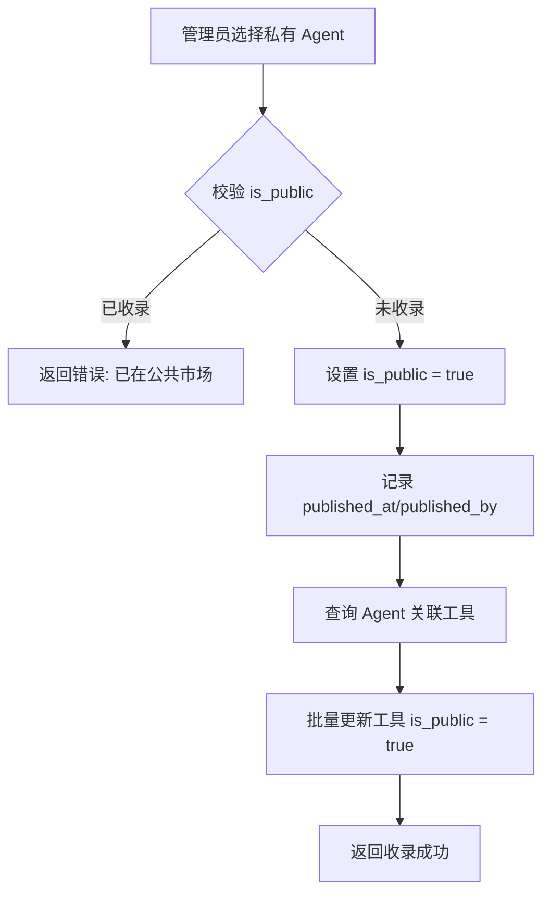
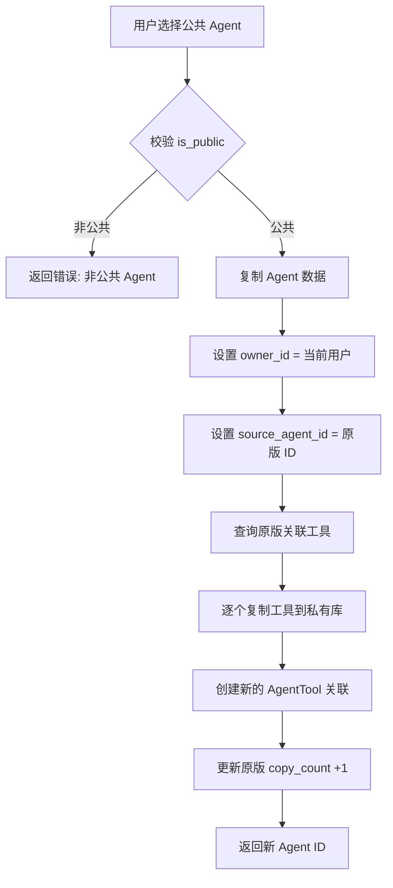
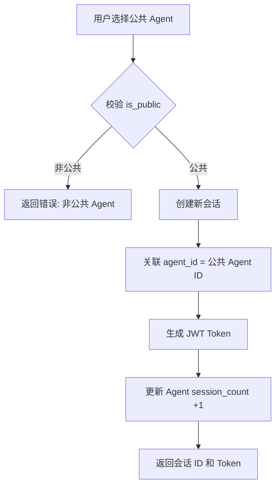
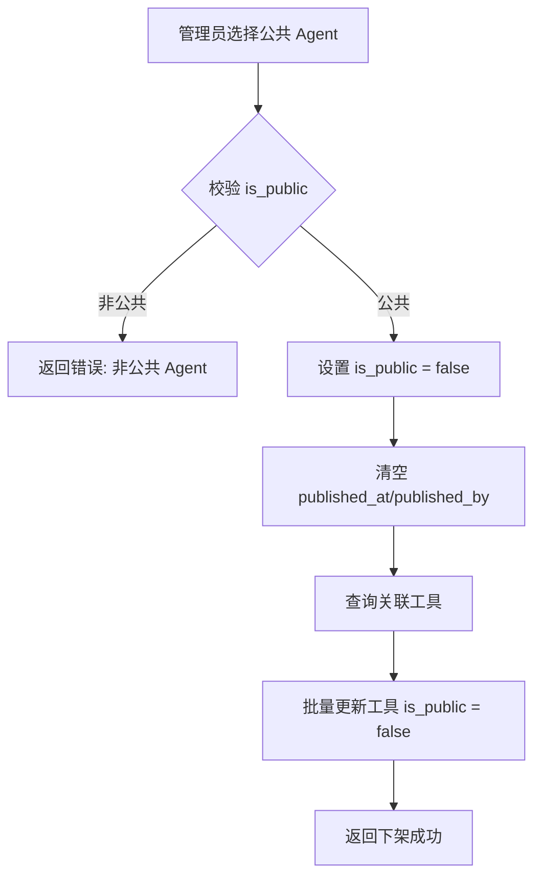
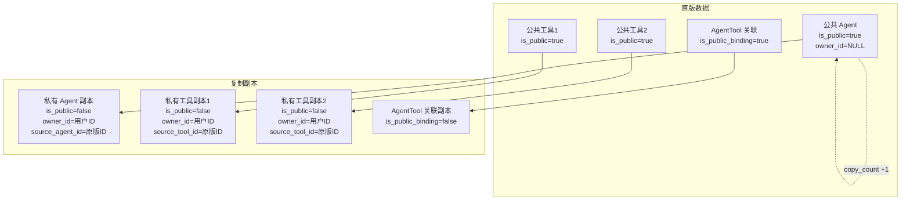

# 企业内部 Agent 测试管理平台 - 公共市场迭代设计文档

## 一、需求概述

### 1.1 核心变更
- **取消用户自主上架功能**：Agent 创建后默认仅存于创建者私有库
- **引入公共市场机制**：管理员收录私有 Agent 至公共市场，全员可查询使用
- **权限隔离体系**：普通用户私有资源隔离，管理员全局管理权限
- **复制机制**：普通用户可复制公共 Agent 到私有库，数据完全隔离

### 1.2 业务角色定义

| 角色 | 权限范围 |
|------|----------|
| **普通用户** | 仅操作自己的私有 Agent/Tool；可读公共市场资源；可复制公共 Agent |
| **管理员** | 全局查询所有用户私有资源；收录/下架公共市场 Agent；查看统计数据 |

---

## 二、数据库表结构设计

### 2.1 User 表扩展

| 字段名 | 类型 | 约束 | 说明 |
|--------|------|------|------|
| `role` | VARCHAR(20) | DEFAULT 'user' | 用户角色：admin/user |

```sql
ALTER TABLE user ADD COLUMN role VARCHAR(20) DEFAULT 'user';
CREATE INDEX idx_user_role ON user(role);
```

### 2.2 Agent 表扩展

| 字段名 | 类型 | 约束 | 说明 |
|--------|------|------|------|
| `is_public` | BOOLEAN | DEFAULT FALSE | 是否收录至公共市场 |
| `owner_id` | INTEGER | FOREIGN KEY (user.id) | 归属用户 ID（替代 created_by） |
| `copy_count` | INTEGER | DEFAULT 0 | 被复制次数统计 |
| `session_count` | INTEGER | DEFAULT 0 | 会话访问次数统计 |
| `published_at` | TIMESTAMP | NULL | 收录时间（仅公共 Agent 有值） |
| `published_by` | INTEGER | FOREIGN KEY (user.id) | 收录人 ID（仅公共 Agent 有值） |
| `source_agent_id` | UUID | FOREIGN KEY (agent.id) | 来源 Agent ID（复制副本指向原版） |

```sql
ALTER TABLE agent ADD COLUMN is_public BOOLEAN DEFAULT FALSE;
ALTER TABLE agent ADD COLUMN owner_id INTEGER REFERENCES user(id);
ALTER TABLE agent ADD COLUMN copy_count INTEGER DEFAULT 0;
ALTER TABLE agent ADD COLUMN session_count INTEGER DEFAULT 0;
ALTER TABLE agent ADD COLUMN published_at TIMESTAMP NULL;
ALTER TABLE agent ADD COLUMN published_by INTEGER REFERENCES user(id);
ALTER TABLE agent ADD COLUMN source_agent_id UUID REFERENCES agent(id);

CREATE INDEX idx_agent_is_public ON agent(is_public);
CREATE INDEX idx_agent_owner_id ON agent(owner_id);
CREATE INDEX idx_agent_source ON agent(source_agent_id);

-- 数据迁移：将 created_by 迁移到 owner_id
UPDATE agent SET owner_id = created_by WHERE created_by IS NOT NULL;
```

### 2.3 Tool 表扩展

| 字段名 | 类型 | 约束 | 说明 |
|--------|------|------|------|
| `is_public` | BOOLEAN | DEFAULT FALSE | 是否公共工具 |
| `owner_id` | INTEGER | FOREIGN KEY (user.id) | 归属用户 ID（私有工具有值） |
| `copy_count` | INTEGER | DEFAULT 0 | 被复制次数统计 |
| `source_tool_id` | UUID | FOREIGN KEY (tool.id) | 来源工具 ID（复制副本指向原版） |

```sql
ALTER TABLE tool ADD COLUMN is_public BOOLEAN DEFAULT FALSE;
ALTER TABLE tool ADD COLUMN owner_id INTEGER REFERENCES user(id);
ALTER TABLE tool ADD COLUMN copy_count INTEGER DEFAULT 0;
ALTER TABLE tool ADD COLUMN source_tool_id UUID REFERENCES tool(id);

CREATE INDEX idx_tool_is_public ON tool(is_public);
CREATE INDEX idx_tool_owner_id ON tool(owner_id);
CREATE INDEX idx_tool_source ON tool(source_tool_id);
```

### 2.4 AgentTool 关联表扩展

| 字段名 | 类型 | 约束 | 说明 |
|--------|------|------|------|
| `is_public_binding` | BOOLEAN | DEFAULT FALSE | 是否公共绑定（公共 Agent 的工具绑定） |

```sql
ALTER TABLE agenttool ADD COLUMN is_public_binding BOOLEAN DEFAULT FALSE;
```

---

## 三、RESTful 接口设计

### 3.1 公共市场接口（全员可调用）

#### 3.1.1 分页查询公共市场 Agent

**GET** `/api/v1/market/agents`

| 参数 | 类型 | 位置 | 必填 | 说明 |
|------|------|------|------|------|
| `page` | INT | Query | 否 | 页码，默认 1 |
| `size` | INT | Query | 否 | 每页数量，默认 20，最大 100 |
| `search` | STRING | Query | 否 | 搜索关键词（名称/描述） |
| `sort_by` | STRING | Query | 否 | 排序字段：copy_count/session_count/created_at |
| `order` | STRING | Query | 否 | 排序方向：asc/desc |

**权限**：全员可访问（无需登录也可查询）

**响应**：
```json
{
  "code": 200,
  "message": "success",
  "data": {
    "items": [
      {
        "id": "uuid",
        "name": "订单查询助手",
        "description": "处理订单查询、状态跟踪",
        "tool_count": 3,
        "copy_count": 15,
        "session_count": 120,
        "published_at": "2024-01-01T00:00:00",
        "publisher_name": "管理员张三"
      }
    ],
    "total": 50,
    "page": 1,
    "size": 20
  }
}
```

---

#### 3.1.2 获取公共 Agent 详情

**GET** `/api/v1/market/agents/{agent_id}`

**权限**：全员可访问

**响应**：
```json
{
  "code": 200,
  "message": "success",
  "data": {
    "id": "uuid",
    "name": "订单查询助手",
    "description": "处理订单查询、状态跟踪",
    "graph_config": { ... },
    "tools": [
      {
        "id": "uuid",
        "name": "订单查询工具",
        "description": "查询订单状态",
        "input_schema": { ... },
        "output_schema": { ... }
      }
    ],
    "copy_count": 15,
    "session_count": 120,
    "published_at": "2024-01-01T00:00:00",
    "publisher_name": "管理员张三"
  }
}
```

---

#### 3.1.3 获取公共 Agent 工作流图数据

**GET** `/api/v1/market/agents/{agent_id}/workflow`

**权限**：全员可访问

**响应**：
```json
{
  "code": 200,
  "message": "success",
  "data": {
    "agent_id": "uuid",
    "mermaid_code": "graph TD\n    A --> B\n    B --> C",
    "nodes": [ ... ],
    "edges": [ ... ]
  }
}
```

---

#### 3.1.4 创建测试会话（基于公共 Agent）

**POST** `/api/v1/market/agents/{agent_id}/sessions`

**权限**：需登录

**请求体**：
```json
{
  "name": "测试订单查询"
}
```

**业务逻辑**：
1. 创建新会话，关联公共 Agent ID
2. 更新公共 Agent 的 `session_count` +1
3. 返回会话 ID 和 Token

**响应**：
```json
{
  "code": 200,
  "message": "success",
  "data": {
    "session_id": "uuid",
    "agent_id": "uuid",
    "agent_name": "订单查询助手",
    "access_token": "jwt_token",
    "expires_at": "2024-01-02T00:00:00"
  }
}
```

---

#### 3.1.5 复制公共 Agent 到私有库

**POST** `/api/v1/market/agents/{agent_id}/copy`

**权限**：需登录（普通用户）

**请求体**：
```json
{
  "new_name": "我的订单助手副本"
}
```

**业务逻辑**（详见第四章）：
1. 复制 Agent 数据，设置 `owner_id` 为当前用户
2. 复制关联工具到用户私有工具库
3. 设置 `source_agent_id` 指向原版
4. 更新原版 Agent 的 `copy_count` +1
5. 返回新 Agent ID

**响应**：
```json
{
  "code": 200,
  "message": "复制成功",
  "data": {
    "new_agent_id": "uuid",
    "new_agent_name": "我的订单助手副本",
    "copied_tools_count": 3
  }
}
```

---

### 3.2 管理员专属接口

#### 3.2.1 全局查询所有用户私有 Agent

**GET** `/api/v1/admin/agents/private`

| 参数 | 类型 | 位置 | 必填 | 说明 |
|------|------|------|------|------|
| `page` | INT | Query | 否 | 页码 |
| `size` | INT | Query | 否 | 每页数量 |
| `owner_id` | INT | Query | 否 | 按用户筛选 |
| `status` | STRING | Query | 否 | 按状态筛选 |

**权限**：仅管理员

**响应**：
```json
{
  "code": 200,
  "message": "success",
  "data": {
    "items": [
      {
        "id": "uuid",
        "name": "私有助手",
        "description": "...",
        "owner_id": 123,
        "owner_name": "用户张三",
        "status": "draft",
        "is_public": false,
        "created_at": "2024-01-01T00:00:00"
      }
    ],
    "total": 100
  }
}
```

---

#### 3.2.2 收录私有 Agent 至公共市场

**POST** `/api/v1/admin/agents/{agent_id}/publish`

**权限**：仅管理员

**请求体**：
```json
{
  "publish_note": "推荐收录，功能完善"
}
```

**业务逻辑**：
1. 校验 Agent 是否已收录（`is_public = true` 则拒绝）
2. 设置 `is_public = true`
3. 设置 `published_at` 和 `published_by`
4. 关联工具标记为公共工具（`is_public = true`）
5. 返回收录成功信息

**响应**：
```json
{
  "code": 200,
  "message": "收录成功",
  "data": {
    "agent_id": "uuid",
    "agent_name": "订单查询助手",
    "published_at": "2024-01-01T00:00:00",
    "published_tools_count": 3
  }
}
```

---

#### 3.2.3 下架公共市场 Agent

**POST** `/api/v1/admin/agents/{agent_id}/unpublish`

**权限**：仅管理员

**请求体**：
```json
{
  "unpublish_reason": "功能已过时"
}
```

**业务逻辑**：
1. 校验 Agent 是否已收录（`is_public = false` 则拒绝）
2. 设置 `is_public = false`
3. 清空 `published_at` 和 `published_by`
4. 关联工具取消公共标记（`is_public = false`）
5. 返回下架成功信息

**响应**：
```json
{
  "code": 200,
  "message": "下架成功",
  "data": {
    "agent_id": "uuid",
    "agent_name": "订单查询助手"
  }
}
```

---

#### 3.2.4 查看公共 Agent 复制统计

**GET** `/api/v1/admin/agents/{agent_id}/stats`

**权限**：仅管理员

**响应**：
```json
{
  "code": 200,
  "message": "success",
  "data": {
    "agent_id": "uuid",
    "agent_name": "订单查询助手",
    "copy_count": 15,
    "session_count": 120,
    "copy_users": [
      {
        "user_id": 123,
        "user_name": "张三",
        "copied_at": "2024-01-01T00:00:00"
      }
    ],
    "recent_sessions": [
      {
        "session_id": "uuid",
        "user_id": 456,
        "user_name": "李四",
        "created_at": "2024-01-02T00:00:00"
      }
    ]
  }
}
```

---

#### 3.2.5 查看公共市场总体统计

**GET** `/api/v1/admin/market/stats`

**权限**：仅管理员

**响应**：
```json
{
  "code": 200,
  "message": "success",
  "data": {
    "total_public_agents": 50,
    "total_private_agents": 200,
    "total_copies": 300,
    "total_sessions": 1500,
    "top_agents": [
      {
        "agent_name": "订单查询助手",
        "copy_count": 15,
        "session_count": 120
      }
    ]
  }
}
```

---

### 3.3 私有 Agent 接口（改造原有接口）

#### 3.3.1 查询我的私有 Agent 列表

**GET** `/api/v1/my/agents`

**权限**：需登录（普通用户）

**业务逻辑**：
- 普通用户：仅返回 `owner_id = 当前用户ID` 且 `is_public = false` 的 Agent
- 管理员：返回所有私有 Agent（调用 `/api/v1/admin/agents/private`）

**响应**：同原接口格式

---

#### 3.3.2 创建私有 Agent

**POST** `/api/v1/my/agents`

**权限**：需登录

**请求体**：同原接口

**业务逻辑**：
1. 设置 `owner_id = 当前用户ID`
2. 设置 `is_public = false`
3. 其他逻辑不变

---

#### 3.3.3 更新私有 Agent

**PUT** `/api/v1/my/agents/{agent_id}`

**权限校验**：
- 普通用户：`owner_id = 当前用户ID` 且 `is_public = false` 才可修改
- 管理员：可修改任意私有 Agent

---

#### 3.3.4 删除私有 Agent

**DELETE** `/api/v1/my/agents/{agent_id}`

**权限校验**：
- 普通用户：`owner_id = 当前用户ID` 且 `is_public = false` 才可删除
- 管理员：可删除任意私有 Agent

---

#### 3.3.5 批量操作私有 Agent

**POST** `/api/v1/my/agents/batch`

**权限校验**：
- 普通用户：仅操作 `owner_id = 当前用户ID` 且 `is_public = false` 的 Agent
- 管理员：可操作任意 Agent

---

### 3.4 私有工具接口（改造原有接口）

#### 3.4.1 查询我的私有工具列表

**GET** `/api/v1/my/tools`

**权限**：需登录

**业务逻辑**：
- 普通用户：返回 `owner_id = 当前用户ID` 的私有工具 + 公共工具（可读）
- 管理员：返回所有工具

---

#### 3.4.2 创建私有工具

**POST** `/api/v1/my/tools`

**业务逻辑**：
1. 设置 `owner_id = 当前用户ID`
2. 设置 `is_public = false`

---

#### 3.4.3 更新/删除私有工具

**权限校验**：
- 普通用户：仅可操作 `owner_id = 当前用户ID` 且 `is_public = false` 的工具
- 管理员：可操作任意工具

---

## 四、业务执行流程设计

### 4.1 收录 Agent 至公共市场流程



**详细步骤**：
1. 管理员调用 `/api/v1/admin/agents/{agent_id}/publish`
2. 校验 Agent 是否已收录（`is_public = true` 则返回错误）
3. 更新 Agent 表：
   - `is_public = true`
   - `published_at = NOW()`
   - `published_by = 管理员ID`
4. 查询 `AgentTool` 关联表，获取所有 `tool_id`
5. 批量更新 Tool 表：
   - `is_public = true`（所有关联工具）
6. 返回收录成功信息

---

### 4.2 复制公共 Agent 到私有库流程



**详细步骤**：
1. 用户调用 `/api/v1/market/agents/{agent_id}/copy`
2. 校验 Agent 是否公共（`is_public = false` 则返回错误）
3. 复制 Agent 数据：
   - 新 Agent ID（UUID）
   - `name = new_name`（用户指定）
   - `owner_id = 当前用户ID`
   - `is_public = false`
   - `source_agent_id = 原版 Agent ID`
   - `copy_count = 0`、`session_count = 0`
4. 查询原版 Agent 的关联工具（通过 `AgentTool`）
5. 逐个复制工具：
   - 新 Tool ID（UUID）
   - `name`、`description`、`function_name` 等不变
   - `owner_id = 当前用户ID`
   - `is_public = false`
   - `source_tool_id = 原版 Tool ID`
   - `copy_count = 0`
6. 创建新的 `AgentTool` 关联：
   - `agent_id = 新 Agent ID`
   - `tool_id = 新 Tool ID`
   - `priority` 保持原版顺序
7. 更新原版 Agent 的 `copy_count += 1`
8. 返回新 Agent ID 和复制信息

---

### 4.3 创建测试会话流程（基于公共 Agent）



---

### 4.4 下架公共 Agent 流程



---

## 五、权限拦截逻辑设计

### 5.1 权限校验中间件

```python
def check_agent_permission(agent_id: UUID, user: User, action: str) -> bool:
    """
    Agent 权限校验逻辑
    
    Args:
        agent_id: Agent ID
        user: 当前用户
        action: 操作类型 (read/update/delete)
    
    Returns:
        bool: 是否有权限
    """
    agent = get_agent(agent_id)
    
    # 公共 Agent：全员可读，普通用户不可修改
    if agent.is_public:
        if action == "read":
            return True
        elif action in ["update", "delete"]:
            return user.role == "admin"
    
    # 私有 Agent：仅 owner 可操作，管理员可全局查看
    if not agent.is_public:
        if action == "read":
            return user.role == "admin" or agent.owner_id == user.id
        elif action in ["update", "delete"]:
            return agent.owner_id == user.id
    
    return False
```

### 5.2 权限拦截规则表

| 资源类型 | 操作 | 普通用户权限 | 管理员权限 |
|----------|------|--------------|------------|
| **私有 Agent** | 查询 | 仅自己的 | 全部 |
| | 修改 | 仅自己的 | 全部 |
| | 删除 | 仅自己的 | 全部 |
| **公共 Agent** | 查询 | 全部 | 全部 |
| | 修改 | 无权限 | 全部 |
| | 删除 | 无权限 | 全部 |
| | 复制 | 有权限 | 有权限 |
| **私有工具** | 查询 | 仅自己的 + 公共工具 | 全部 |
| | 修改 | 仅自己的 | 全部 |
| | 删除 | 仅自己的 | 全部 |
| **公共工具** | 查询 | 全部 | 全部 |
| | 修改 | 无权限 | 全部 |
| | 删除 | 无权限 | 全部 |

---

## 六、副本复制数据流转逻辑

### 6.1 数据流转图



### 6.2 数据隔离规则

| 数据项 | 原版（公共） | 副本（私有） | 隔离说明 |
|--------|--------------|--------------|----------|
| Agent ID | 原版 UUID | 新 UUID | 完全独立 |
| 工具 ID | 原版 UUID | 新 UUID | 完全独立 |
| 关联关系 | 原版 AgentTool | 新 AgentTool | 完全独立 |
| 统计数据 | copy_count/session_count | 初始化为 0 | 不继承原版统计 |
| 配置数据 | graph_config | 复制原版 | 可独立修改 |
| 归属关系 | 无 owner | 当前用户 | 完全隔离 |

---

## 七、接口改造清单

### 7.1 原接口改造列表

| 原接口路径 | 改造内容 | 新路径 |
|------------|----------|--------|
| `/api/v1/agents` | 拆分为私有和公共 | `/api/v1/my/agents` |
| `/api/v1/agents/{id}` | 增加权限校验 | `/api/v1/my/agents/{id}` |
| `/api/v1/agents/batch` | 增加权限校验 | `/api/v1/my/agents/batch` |
| `/api/v1/agents/tools` | 拆分为私有和公共 | `/api/v1/my/tools` |
| `/api/v1/agents/tools/{id}` | 增加权限校验 | `/api/v1/my/tools/{id}` |

### 7.2 新增接口列表

| 接口路径 | 功能 | 权限 |
|----------|------|------|
| `/api/v1/market/agents` | 公共市场列表 | 全员 |
| `/api/v1/market/agents/{id}` | 公共 Agent 详情 | 全员 |
| `/api/v1/market/agents/{id}/workflow` | 公共 Agent 工作流 | 全员 |
| `/api/v1/market/agents/{id}/sessions` | 创建测试会话 | 登录用户 |
| `/api/v1/market/agents/{id}/copy` | 复制到私有库 | 登录用户 |
| `/api/v1/admin/agents/private` | 全局私有 Agent 查询 | 管理员 |
| `/api/v1/admin/agents/{id}/publish` | 收录至公共市场 | 管理员 |
| `/api/v1/admin/agents/{id}/unpublish` | 下架公共 Agent | 管理员 |
| `/api/v1/admin/agents/{id}/stats` | 查看统计 | 管理员 |
| `/api/v1/admin/market/stats` | 公共市场总体统计 | 管理员 |

---

## 八、数据库迁移脚本

### 8.1 迁移文件

```python
# alembic/versions/03_public_market.py

def upgrade() -> None:
    # User 表扩展
    op.add_column('user', sa.Column('role', sa.String(20), default='user'))
    op.create_index('ix_user_role', 'user', ['role'])
    
    # Agent 表扩展
    op.add_column('agent', sa.Column('is_public', sa.Boolean(), default=False))
    op.add_column('agent', sa.Column('owner_id', sa.Integer(), sa.ForeignKey('user.id')))
    op.add_column('agent', sa.Column('copy_count', sa.Integer(), default=0))
    op.add_column('agent', sa.Column('session_count', sa.Integer(), default=0))
    op.add_column('agent', sa.Column('published_at', sa.DateTime(), nullable=True))
    op.add_column('agent', sa.Column('published_by', sa.Integer(), sa.ForeignKey('user.id')))
    op.add_column('agent', sa.Column('source_agent_id', postgresql.UUID(as_uuid=True), sa.ForeignKey('agent.id')))
    
    op.create_index('ix_agent_is_public', 'agent', ['is_public'])
    op.create_index('ix_agent_owner_id', 'agent', ['owner_id'])
    op.create_index('ix_agent_source', 'agent', ['source_agent_id'])
    
    # Tool 表扩展
    op.add_column('tool', sa.Column('is_public', sa.Boolean(), default=False))
    op.add_column('tool', sa.Column('owner_id', sa.Integer(), sa.ForeignKey('user.id')))
    op.add_column('tool', sa.Column('copy_count', sa.Integer(), default=0))
    op.add_column('tool', sa.Column('source_tool_id', postgresql.UUID(as_uuid=True), sa.ForeignKey('tool.id')))
    
    op.create_index('ix_tool_is_public', 'tool', ['is_public'])
    op.create_index('ix_tool_owner_id', 'tool', ['owner_id'])
    op.create_index('ix_tool_source', 'tool', ['source_tool_id'])
    
    # AgentTool 表扩展
    op.add_column('agenttool', sa.Column('is_public_binding', sa.Boolean(), default=False))
    
    # 数据迁移
    op.execute("UPDATE agent SET owner_id = created_by WHERE created_by IS NOT NULL")
    op.execute("UPDATE tool SET owner_id = NULL")  # 原有工具无归属，视为公共


def downgrade() -> None:
    # AgentTool 表
    op.drop_column('agenttool', 'is_public_binding')
    
    # Tool 表
    op.drop_index('ix_tool_source', 'tool')
    op.drop_index('ix_tool_owner_id', 'tool')
    op.drop_index('ix_tool_is_public', 'tool')
    op.drop_column('tool', 'source_tool_id')
    op.drop_column('tool', 'copy_count')
    op.drop_column('tool', 'owner_id')
    op.drop_column('tool', 'is_public')
    
    # Agent 表
    op.drop_index('ix_agent_source', 'agent')
    op.drop_index('ix_agent_owner_id', 'agent')
    op.drop_index('ix_agent_is_public', 'agent')
    op.drop_column('agent', 'source_agent_id')
    op.drop_column('agent', 'published_by')
    op.drop_column('agent', 'published_at')
    op.drop_column('agent', 'session_count')
    op.drop_column('agent', 'copy_count')
    op.drop_column('agent', 'owner_id')
    op.drop_column('agent', 'is_public')
    
    # User 表
    op.drop_index('ix_user_role', 'user')
    op.drop_column('user', 'role')
```

---

## 九、实施计划

### 9.1 开发顺序

| 阶段 | 任务 | 预估工时 |
|------|------|----------|
| **Phase 1** | 数据库表结构扩展 + 迁移脚本 | 4h |
| **Phase 2** | 权限校验中间件 + 用户角色扩展 | 4h |
| **Phase 3** | 公共市场接口开发（5个） | 8h |
| **Phase 4** | 管理员专属接口开发（5个） | 6h |
| **Phase 5** | 私有接口改造 + 权限拦截 | 6h |
| **Phase 6** | 复制逻辑实现 + 工具联动 | 6h |
| **Phase 7** | 单元测试 + 接口文档 | 4h |

---

## 十、附录

### 10.1 错误码定义

| 错误码 | 说明 |
|--------|------|
| 403001 | 无权限操作该资源 |
| 403002 | 公共资源不可修改 |
| 403003 | 仅管理员可执行此操作 |
| 404001 | Agent 不存在 |
| 404002 | 工具不存在 |
| 400001 | Agent 已在公共市场 |
| 400002 | Agent 未收录至公共市场 |

---

**文档版本**: v2.0  
**创建时间**: 2026-06-15  
**适用项目**: 企业内部 Agent 测试管理助手平台 - 公共市场迭代